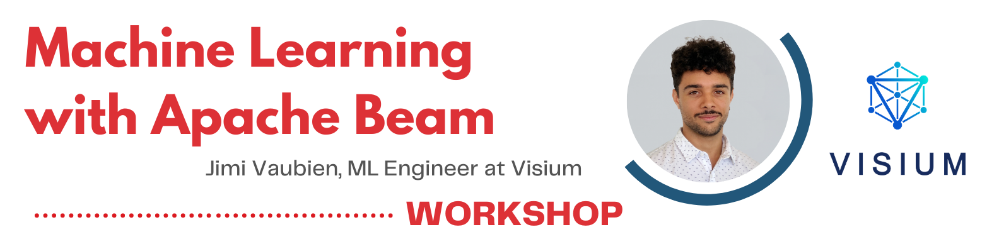

# DAG x Visium: Machine Learning with Apache Beam



Code-along workshop introducing the basics of Apache Beam. Hosted by Jimi Vaubien, Machine Learning Engineer at Visium, this workshop allows you to buff up your data scientist toolkit!


## Coding environment

### Noto

Noto already has quite a few libraries installed by default. The only one that is not installed and that we will use is Apache Beam, which can be installed using the Noto virtual environment framework:

```
my_venvs_create dag
my_venvs_activate dag
pip install apache-beam
my_kernels_create dag "DAG"
```

You can then simply select the DAG kernel when working on the workshop's notebook (top-right of the page).

### Google Colab

If you are using Colab, the only required installation is also Apache Beam. You can simply create a new code cell and run `!pip install apache-beam`.

WARNING: if you are using Colab, you will need to download `train.csv` and `test.csv` and place them in a folder called `data/` at the root of the repository:

* [Train dataset](https://drive.google.com/file/d/1rsrAu4F13UCHsKpWjxRIh0ObsjWSMVSE/view?usp=sharing)
* [Test dataset](https://drive.google.com/file/d/1yjX4e2U2auLQn01HYUgBKEJT8q3g15BJ/view?usp=sharing)

You should have the following file structure:

```
|-- README.md            <-- the current file
|-- Machine Learning with Apache Beam.ipynb    <-- workshop notebook
|-- data                 <-- contains dataset used in workshop
|-- |-- train.csv
|-- |-- test.csv
|-- assets/              <-- contains images used in repo

```

### Local

Whether you are using conda, your base python installation, or a classis python venv, you need the following libraries:

* pandas
* scikit-learn
* apache-beam

Above that you will need to download the dataset and place it in the `data/` folder as explained above.